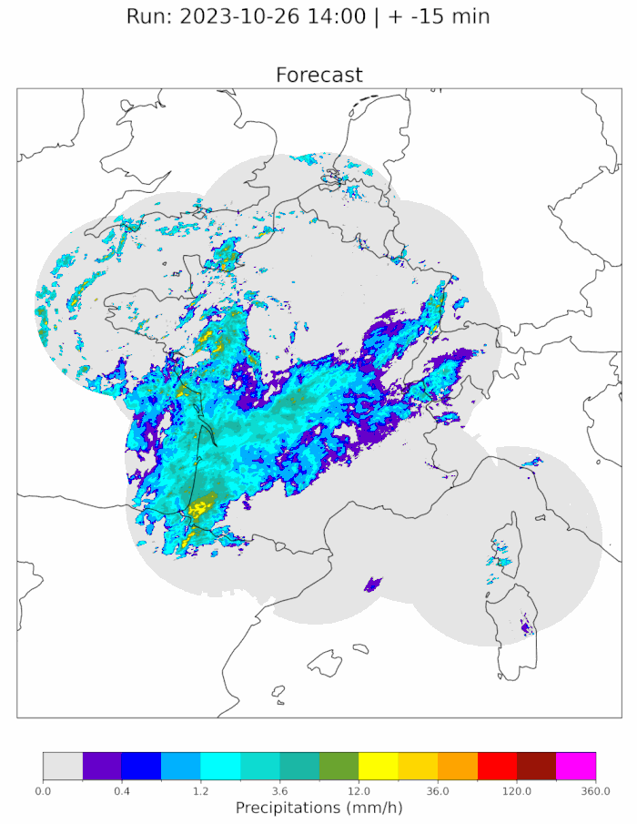

# Rainfall Nowcasting in France using the DGMR Model

This repository applies the pre-trained Deep Generative Model of Rainfall (DGMR) developed by Google DeepMind to Meteo-France rainfall data. The goal of this project is to provide real-time, high-quality short-term rainfall forecasts (nowcasting) for France.



## Table of Contents
- [Features](#features)
- [Installation](#installation)
- [Usage](#usage)
- [Data Sources](#data-sources)
- [Model Architecture](#model-architecture)
- [Licenses](#licenses)
- [Contributors](#contributors)

## Features
- Download radar data through the Meteo-France public data API
- Short-term rainfall forecasting: max lead time 2h, timestep 5min, resolution 1km
- Utilizes the DGMR pre-trained (UK data) model for realistic forecasts
- Visualizations of rainfall predictions with GIFs

## Installation

### Clone the Repository

```bash
git clone https://github.com/meteofrance/dgmr
cd dgmr
```

### Install Environment

With micromamba or conda:

```bash
micromamba create -f environment.yml
```

```bash
micromamba activate dgmr
```

### Create the API Key on Météo-France's Portal

If you don't already have an account on the [Météo-France Public Data portal](https://portail-api.meteofrance.fr/web/en/), please create one.

1. Once connected, subscribe to the **Radar data** API (not the "Radar Package" one).

2. Then click on **Configure the API**.

3. Select **API Key** as the token type, **enter the duration** (in seconds), and **Generate Token**.

4. **Copy the token**; you will need it in the next step.

### Download the Pretrained Model from DeepMind

Go to this [Google Cloud Storage](https://console.cloud.google.com/storage/browser/dm-nowcasting-example-data?pageState=(%22StorageObjectListTable%22:(%22f%22:%22%255B%255D%22))&project=friendly-retina-382415) link and download the whole folder `dm-nowcasting-example-data/tfhub_snapshots/1536x1280` (this folder contains the pre-trained model with a size of 1536x1280).

Note that the AI model is licensed under Creative Commons BY 4.0.

### Set Up Environment Variables
Create a `.env` file in the root directory and add your configuration settings:
```plaintext
METEO_FRANCE_API_KEY="<your_meteo_france_api_key>"
METEO_FRANCE_DATA_PATH="<path_to_save_the_downloaded_data>"
DGMR_MODEL_PATH="<path_to_the_pretrained_dgmr_folder>/1536x1280/"
DGMR_PLOT_PATH="<path_to_save_the_plots>"
```
If METEO_FRANCE_DATA_PATH is empty, downloaded data will be saved in `./data`.

If DGMR_PLOT_PATH is empty, forecast GIFs will be saved in `./plot`.


## Usage

### Downloading Data with Meteo-France's API

Simply run the script `./dgmr/download_data.sh` to download the latest radar images.

### Setting up a Cron Job for Automated Data Download

For real-time forecasting, we need to download the radar data every 5 minutes.

To automate the data downloading process using a cron job, follow these steps:

1. Open your terminal and type `crontab -e` to edit the cron table.

2. Add a new line at the end of the file to define the cron job. The general syntax for a cron task is:
    ```bash
    */5 * * * * <ABSOLUTE_PATH_TO_REPO>/dgmr/download_data.sh
    ```

### Making Forecasts

To make a real-time rainfall nowcast, use:

```bash
python main.py
```

This script expects that you have already downloaded the 4 latest radar images.

It saves the forecast as a GIF in the plot folder defined by the `DGMR_PLOT_PATH` env variable.

## Data Sources

This project uses rainfall data from [Meteo-France](https://donneespubliques.meteofrance.fr/).

The H5 files contain 5-minute cumulated rainfall data over France, with a 500m resolution.

To match the pre-trained model inputs, we convert the data to instantaneous rainfall (mm/h) and downgrade the resolution to 1km.

## Model Architecture

The DGMR model is a state-of-the-art generative model designed for weather nowcasting. It leverages a combination of convolutional neural networks (CNNs) and generative adversarial networks (GANs) to produce high-resolution, realistic rainfall forecasts.

For more details, please see [Ravuri, S., Lenc, K., Willson, M. et al. Skilful precipitation nowcasting using deep generative models of radar. Nature 597, 672–677 (2021)](https://doi.org/10.1038/s41586-021-03854-z).

A notebook is also available as a supplement to the article: [notebook](https://github.com/google-deepmind/deepmind-research/tree/master/nowcasting).

The DGMR model is under the terms of the [Creative Commons Attribution 4.0 International License](https://creativecommons.org/licenses/by/4.0/).

## Licenses

- The DGMR pre-trained model is licensed under the [Creative Commons Attribution 4.0 International License](https://creativecommons.org/licenses/by/4.0/).
- Radar data from Météo-France are licensed under the [Open Licence](https://www.etalab.gouv.fr/wp-content/uploads/2014/05/Open_Licence.pdf).
- The code in this repository is licensed under the [Apache License, Version 2.0](https://apache.org/licenses/LICENSE-2.0).

## Contributors

- From **Météo-France's AI Lab**: Théo Tournier, Léa Berthomier, Frank Guibert, Bruno Pradel
- From the French **National School of Meteorology**: Flora Chapelle, Hugo Germain, Paul Lacotte & Ariadna Perello
